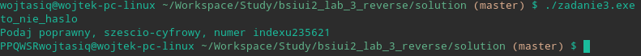
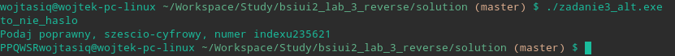

# Tools used:
1. radare2 https://rada.re/n/
2. cutter https://cutter.re/
3. Ghidra https://ghidra-sre.org/

For index `235621` output was `PPQWSR`  
Screenshots of output:  
  
  
Also can be seen in `./img` directory 

## solution.zip
- solution.zip encrypted with AES256 password  
- pasword hint - lowarcase
